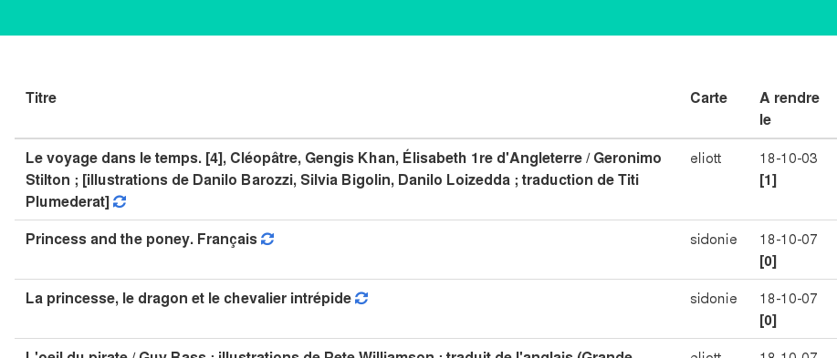

# Nelligan++

An application to manage multiple accounts of book library for the Montreal Nelligan system.



## How to run the tool on Heroku ?

Just push the repo on heroku. really. It rely on a postgresql addon and that's all.

## How to run the tool locally ?

This is a Django application. The needed package are described in requirements.txt as
usual for a Python application :

```
$ workon nelligan # always good to be in a virtualenv
$ pip install -r requirements.txt
./manage.py runserver
```

And then check on http://localhost:8000

## Testing heroku instance

Available [here](http://nelligan.herokuapp.com/). Be nice, it is a free dyno so
very few DB rows available and it shutdown after 30mn without usage.

## Blog article

Available [here](https://sidoine.org/the-web-is-an-api-scrap-it-6e46d496c195).
It explains my motivation and my goals !
